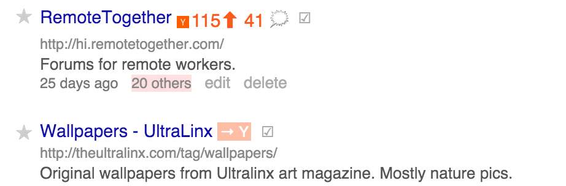

HackerCreep
===========

*Integrating Pinboard and HackerNews to bring about Armageddon.*

Wat
----

While browsing Pinboard, if a link was posted to HN, 
it will tell you score and number of comments, and link to the thread.
If the link has never been posted, the link will take you to the (helpfully
prefilled) submission form.

Feature requests welcome.

Supported Browsers
-------------------

* Chrome
* Firefox / Greasemonkey script
* Firefox / WebExtensions package 
(eventually. At the moment it would only work in Developer and Nightly anyway)

Safari is not going to happen unless someone kindly donates towards an Apple developer subscription.

Instructions
------------

Just pick the extension you need from the repository. 
If you don't know how, just go to your appstore and get it from there.

Credits / Contact
-----------------
@ Giacomo Lacava, 2016 - released under [GPL](LICENSE).

Use github for patches and issues, or mail me at g.lacava on gmail.

